# Phase 3 - Cairo Game Contract Architecture

## Overview
This document details the architecture for the on-chain game state manager. The Garaga-generated verifier handles ZK proof verification; this contract manages match state and game logic.

## Critical Design Decision

### Issue: Private vs Public Inputs in Noir Circuit
The current circuit at [`circuit/src/main.nr`](circuit/src/main.nr:1) has:
- **Public input**: `commitment` only
- **Private inputs**: position, trap1, trap2, trap3, salt

**Problem**: ZK proofs keep private inputs hidden. After `verify_ultra_keccak_honk_proof()` returns, we only get back the public inputs - which is just the commitment. We cannot extract the actual position/trap values to determine the winner.

### Solution Required
The Noir circuit MUST be updated to include revealed values as public inputs:
```nr
fn main(
    position: Field,
    trap1: Field,
    trap2: Field,
    trap3: Field,
    salt: Field,
    // Public inputs - visible on-chain after reveal
    commitment: pub Field,
    revealed_position: pub Field,
    revealed_trap1: pub Field,
    revealed_trap2: pub Field,
    revealed_trap3: pub Field,
) {
    // Existing constraints...
    
    // NEW: Verify revealed values match private inputs
    assert(position == revealed_position);
    assert(trap1 == revealed_trap1);
    assert(trap2 == revealed_trap2);
    assert(trap3 == revealed_trap3);
}
```

This ensures:
1. Commitment is still private during commit phase
2. At reveal, player submits their actual position/traps as public inputs
3. Circuit verifies the public inputs match what was committed
4. Contract can use revealed values for game logic

---

## Contract Data Structures

### Enums

```cairo
#[derive(Drop, Serde, PartialEq)]
enum MatchState {
    Waiting: (),      // Waiting for player B to join
    InProgress: (),   // Match active (rounds 1-3)
    Settled: (),      // Match complete, pot distributed
}

#[derive(Drop, Serde, PartialEq)]
enum RoundState {
    Open: (),         // Players can submit commitments
    Committed: (),    // Both committed, waiting for proofs
    Proving: (),     // Both submitted proofs, verifying
    Resolved: (),     // Round result finalized
}
```

### Structs

```cairo
#[derive(Drop, Serde, Clone)]
struct Round {
    commitment_a: felt252,
    commitment_b: felt252,
    revealed_position_a: u8,
    revealed_position_b: u8,
    revealed_traps_a: (u8, u8, u8),
    revealed_traps_b: (u8, u8, u8),
    state: RoundState,
    score_a: u16,     // Risk-weighted score for this round
    score_b: u16,
}

#[derive(Drop, Serde)]
struct Match {
    player_a: starknet::ContractAddress,
    player_b: starknet::ContractAddress,
    bet_amount: u256,
    round_number: u8,           // 1-3
    cumulative_score_a: u16,    // Sum of all round scores
    cumulative_score_b: u16,
    rounds: LegacyMap<u8, Round>,  // Indexed by round_number
    state: MatchState,
}
```

---

## Contract Storage

```cairo
#[storage]
struct Storage {
    // Match management
    match_counter: u256,
    matches: LegacyMap<u256, Match>,
    player_to_match: LegacyMap<starknet::ContractAddress, u256>,
    
    // Game configuration
    platform_fee_percent: u8,  // e.g., 1 for 1%
}
```

---

## External Functions (Interface)

```cairo
#[starknet::interface]
trait ILastChairGame<TContractState> {
    // Match lifecycle
    fn create_match(ref self: TContractState, bet_amount: u256) -> u256;
    fn join_match(ref self: TContractState, match_id: u256) -> ();
    
    // Round flow
    fn submit_commitment(ref self: TContractState, match_id: u256, commitment: felt252) -> ();
    fn submit_reveal(
        ref self: TContractState, 
        match_id: u256, 
        proof_with_hints: Span<felt252>,
        revealed_position: u8,
        revealed_trap1: u8,
        revealed_trap2: u8,
        revealed_trap3: u8,
    ) -> ();
    
    // Queries
    fn get_match(self: @TContractState, match_id: u256) -> Match;
    fn get_round(self: @TContractState, match_id: u256, round: u8) -> Round;
}
```

---

## Game Logic

### Scoring Algorithm (per round)

```cairo
fn calculate_round_score(
    my_position: u8,
    my_traps: (u8, u8, u8),
    opponent_position: u8,
    opponent_traps: (u8, u8, u8),
) -> u16 {
    // Survival: Did I land on a trap? (Trapped = 0, Safe = 1)
    let trapped = is_trapped(my_position, my_traps);
    let survival: u16 = if trapped { 0 } else { 1 };
    
    // Risk Factor: Higher chair = higher risk = higher multiplier
    // Chair 12 = 12x, Chair 1 = 1x
    let risk_multiplier: u16 = my_position.into();
    
    // Strategy: Did I trap the opponent?
    let trapped_opponent = is_trapped(opponent_position, my_traps);
    let trap_bonus: u16 = if trapped_opponent { 10 } else { 0 };
    
    // Total: survival * risk + trap_bonus
    // Example: Safe on chair 12, trapped opponent = 12 + 10 = 22
    // Example: Trapped on chair 1 = 0 (survival = 0)
    return survival * risk_multiplier + trap_bonus;
}
```

### Settlement Algorithm (after 3 rounds)

```cairo
fn calculate_payout(
    total_pot: u256,
    fee_percent: u8,
    score_a: u16,
    score_b: u16,
) -> (u256, u256) {
    let fee = (total_pot * fee_percent.into()) / 100;
    let distributable = total_pot - fee;
    
    let total_score = score_a + score_b;
    if total_score == 0 {
        // Edge case: both got trapped every round = 50/50
        return (distributable / 2, distributable / 2);
    }
    
    let payout_a = (distributable * score_a.into()) / total_score.into();
    let payout_b = distributable - payout_a;
    
    return (payout_a, payout_b);
}
```

---

## Integration with Garaga Verifier

The contract will import and call the existing verifier:

```cairo
use super::honk_verifier::IUltraKeccakHonkVerifierDispatcher;

fn verify_proof(
    proof: Span<felt252>,
    commitment: felt252,
    revealed_position: u8,
    revealed_trap1: u8,
    revealed_trap2: u8,
    revealed_trap3: u8,
) -> bool {
    let verifier = IUltraKeccakHonkVerifierDispatcher {
        contract_address: self.verifier_address()
    };
    
    // Build public inputs array
    let mut public_inputs = ArrayTrait::new();
    public_inputs.append(commitment.into());
    public_inputs.append(revealed_position.into());
    public_inputs.append(revealed_trap1.into());
    public_images.append(revealed_trap2.into());
    public_inputs.append(revealed_trap3.into());
    
    let result = verifier.verify_ultra_keccak_honk_proof(proof);
    // Result contains public inputs if valid
    return result.is_some();
}
```

---

## Execution Flow Diagram

```mermaid
sequenceDiagram
    participant A as Player A
    participant B as Player B
    participant C as Contract
    
    Note over A,B: Round begins (state=Open)
    A->>C: submit_commitment(hashA)
    B->>C: submit_commitment(hashB)
    Note over C: Both committed → state=Committed
    
    A->>C: submit_reveal(proofA, posA, trapsA)
    B->>C: submit_reveal(proofB, posB, trapsB)
    Note over C: Verify proofs, calculate scores
    Note over C: state=Resolved
    
    A->>C: settle_round() 
    Note over C: Store round scores, advance round_number
    
    Note over A,B: Repeat for 3 rounds
    
    A->>C: settle_match()
    Note over C: Calculate total scores, split pot, transfer
    Note over C: state=Settled
```



---

## Deliverables Checklist

- [ ] Update Noir circuit to include revealed values as public inputs
- [ ] Recompile circuit: `nargo compile`
- [ ] Regenerate Garaga verifier: `garaga gen --system ultra_keccak_honk`
- [ ] Create LastChairGame.cairo contract
- [ ] Implement all storage and functions
- [ ] Add comprehensive tests
- [ ] Deploy to Sepolia testnet

---

## Open Questions for Team

1. **Timeout handling**: What happens if a player commits but never reveals? Should there be a timeout?
2. **Anti-front-running**: Should commitments be encrypted or can other players see them?
3. **Minimum bet**: Should there be a minimum bet amount to prevent spam?
4. **Platform fee**: 1% as specified, or configurable?
5. **Match expiration**: Should matches expire if Player B never joins?
